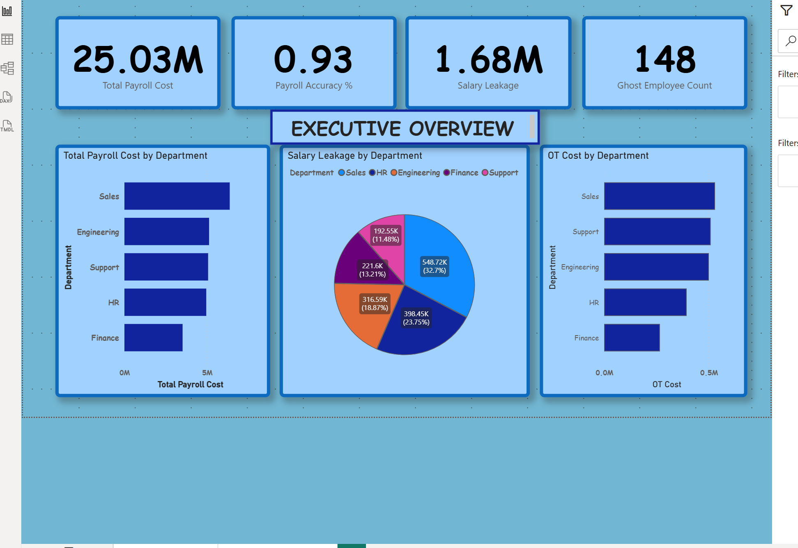
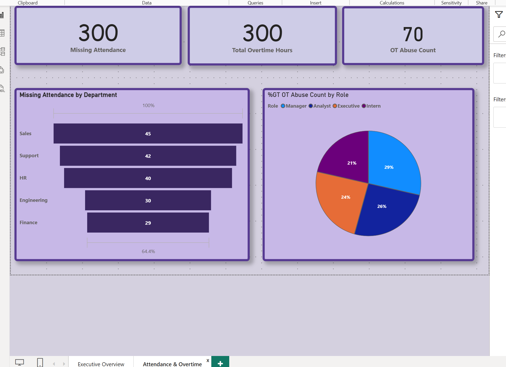

# ZENVY-HR-Intelligence-Payroll-Risk-Dashboard
This project focuses on building an HR Intelligence Dashboard for ZENVY, an AI-powered payroll platform. The objective is to analyze payroll data, detect financial leakages, identify compliance risks, and provide executive-level insights using Power BI and DAX measures only.

The dashboard simulates real-world payroll challenges such as:
Salary leakage
Overtime abuse
Ghost employees
Missing attendance
Duplicate salary credits

Business Objectives
Monitor total payroll cost and efficiency
Detect payroll fraud and compliance risks
Identify overtime misuse and attendance gaps
Provide actionable insights for HR and leadership teams

Dashboard Structure
🔹 Page 1: Executive Overview
Total Payroll Cost
Payroll Accuracy %
Salary Leakage
Ghost Employee Count
Overtime % of Payroll

🔹 Page 2: Attendance & Overtime
Missing attendance analysis
Overtime abuse by department and role

Key Business Insights
Salary leakage was detected due to duplicate salary credits and improper payroll controls.
Inactive employees continued receiving salaries, indicating a critical compliance gap.
Certain departments showed disproportionately high overtime costs, suggesting inefficiencies or misuse.
Missing attendance records reduced payroll accuracy and audit reliability.
